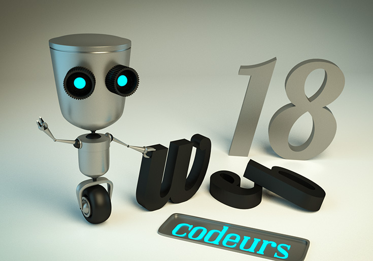

# François Perreau  

  Bonjour,  
  Je débute la formation [codeursweb18](https://www.codeursweb18.fr), un partenariat entre [pôle emploi](http://www.pole-emploi.fr), la [BGE](http://www.placedesprojets.fr/item/bge-cher-bourges/) et l’association [EGGE](http://www.egee.asso.fr/spip.php?rubrique307).  
  Et c’est dans ce cadre que je suis le programme **Game of Codes** de [SIMPLON](http://www.simplonline.co)  

## Expérience professionnelle   
* Graphiste chez *CDJ publicité*  
* Graphiste chez [*A.S.O.*](http://www.aso.fr)  

## Formation  
* InDesign  
* Photoshop  
* Illustrator  

## Pourquoi je suis sur Simplonline ?  
Parce que je suis graphiste print, et je veux pouvoir travailler aussi sur des projets digitaux.  

## Divers  
### Mon ressenti du moment  

  

### Instants récréatifs  

  
  

